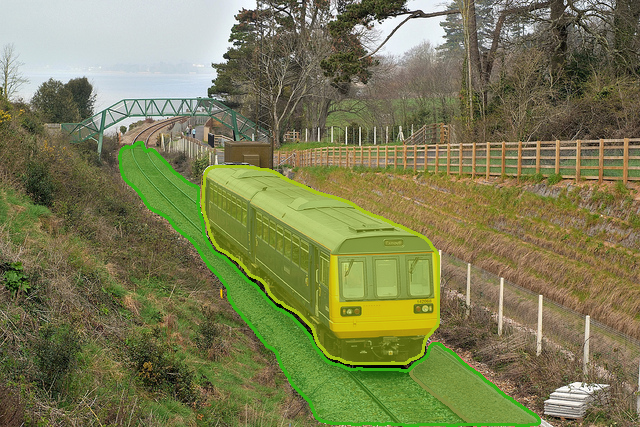
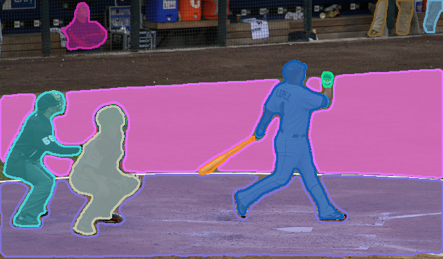

# WISH: Weakly Supervised Instance Segmentation using Heterogeneous Labels

WISH is a framework for instance segmentation using mixed weak supervision (image-level tags, point annotations, and bounding boxes) with Mask2Former R50 backbone and frozen SAM ViT-B prompt encoder.

**Paper**: *"WISH: Weakly Supervised Instance Segmentation using Heterogeneous Labels"* (CVPR 2025)

<table>
  <tr>
    <td></td>
    <td></td>
  </tr>
</table>

---

## Table of Contents

1. [Overview](#overview)
2. [Quick Start](#quick-start)
3. [Installation & Setup](#installation--setup)
4. [Dataset Preparation](#dataset-preparation)
5. [Training](#training)
6. [Evaluation](#evaluation)
7. [Inference](#inference)
8. [Configuration](#configuration)
9. [Weak Label Types](#weak-label-types)
10. [Metrics & Results](#metrics--results)
11. [Architecture & Implementation](#architecture--implementation)

---

### Key Components

- **Backbone**: Mask2Former R50 (pretrained on COCO panoptic)
- **Prompt Encoder**: SAM ViT-B (frozen during training)
- **Decoder**: Multi-scale masked transformer with prompt embedding
- **Supervision**: Heterogeneous weak labels (tags/points/boxes)
- **Datasets**: COCO 2017, Pascal VOC 2012

### Architecture

```
Input Image
    ↓
[Backbone: R50]  [SAM Image Encoder (frozen)]
    ↓                      ↓
Features              Image Embeddings
    ↓                      ↓
[CAM Head]  ←─  [Weak Labels] ─→ [SAM Prompt Encoder]
    ↓                                    ↓
Tags → Points                    Prompt Embeddings (Z)
    ↓                                    ↓
[Hungarian Matcher]  ←─────────────────┘
    ↓
[Transformer Decoder + Prompt Embed MLP]
    ↓
Mask Predictions (H_mask)
    ↓
[Loss: L_seg + L_cam + L_self]
```

### Core Equations

| Eq | Component | What It Does |
|---|---|---|
| Eq.7 | SAM Split | Encodes image once, reuse for all prompts |
| Eq.8-10 | M̂, ŷ_cls, Ẑ | Decoder output + prompt projection |
| Eq.11-13 | Matching Cost | Classification + KLD prompt + min SAM mask |
| Eq.14-15 | Loss | Weighted sum of CE, prompt, mask losses |
| Eq.16-19 | CAM Head | Tag supervision → class activation maps → points |
| Eq.20 | Total Loss | L_seg + α·L_cam + β·L_self (with warmup gating) |

---

## Quick Start

### COCO 2017 (80 classes)

```bash
./hetero/scripts/train_wish_coco.sh

# Multi-GPU (8x, paper spec)
NUM_GPUS=8 ./hetero/scripts/train_wish_coco_8gpu.sh SOLVER.IMS_PER_BATCH 16 SOLVER.BASE_LR 1e-4 SOLVER.MAX_ITER 368750

# Evaluate
WEIGHTS=outputs/hetero_v2/model_final.pth ./hetero/scripts/eval_wish_coco.sh

# Inference
./hetero/scripts/infer_wish.sh path/to/image.jpg
```

### Pascal VOC 2012 (20 classes)

```bash
# Single GPU
./hetero/scripts/train_wish_voc.sh

# Multi-GPU (4x)
NUM_GPUS=4 ./hetero/scripts/train_wish_voc_mgpu.sh

# Evaluate
WEIGHTS=outputs/hetero_voc2012/model_final.pth ./hetero/scripts/eval_wish_voc.sh

# Inference
./hetero/scripts/infer_wish_voc.sh path/to/image.jpg
```

---

## Installation & Setup

### Environment

```bash
cd /path/to/project
source .venv/bin/activate  # or create: python -m venv .venv && source .venv/bin/activate
```

### Required Checkpoints

Download to `hetero/vendor/*/checkpoints/`:

1. **Mask2Former R50 (instance-seg preferred, panoptic fallback)**
   ```
   hetero/vendor/Mask2Former/checkpoints/maskformer2_R50_bs16_50ep.pkl
   ```
   - Fallback (panoptic): backbone matches, mask head retrains

2. **SAM ViT-B**
   ```
   hetero/vendor/segment-anything/checkpoints/sam_vit_b_01ec64.pth
   ```

### Environment Variables

Scripts automatically set:
```bash
export PYTHONPATH="$PWD:$PWD/hetero/vendor/Mask2Former:$PWD/hetero/vendor/segment-anything:$PYTHONPATH"
export DETECTRON2_DATASETS="$PWD/data"
export PYTHONWARNINGS="ignore"
export TF_CPP_MIN_LOG_LEVEL="3"
```

---

## Dataset Preparation

### COCO 2017

**Expected Structure**:
```
data/
├── coco2017/
│   ├── train2017/         # 118k training images
│   ├── val2017/           # 5k validation images
│   └── annotations/
│       ├── instances_train2017.json
│       └── instances_val2017.json
```

**Or use symlink**:
```bash
[ -e data/coco ] || ln -s coco2017 data/coco
```

**Download**: See [COCO Dataset](https://cocodataset.org/#download)

### Pascal VOC 2012

**Expected Structure**:
```
data/
└── PASCAL VOC 2012/
    ├── JPEGImages/                    # All images
    ├── Annotations/                   # XML annotations
    └── ImageSets/Main/
        ├── train.txt                  # Training split (~5.7k)
        ├── val.txt                    # Validation split (~5.8k)
        └── test.txt                   # Test split (not used here)
```

**Or use symlink**:
```bash
[ -e data/voc ] || ln -s "PASCAL VOC 2012" data/voc
```

**Download**: See [Pascal VOC](http://host.robots.ox.ac.uk/pascal/VOC/voc2012/)

---

## Training

### Single-GPU Training

```bash
# COCO (default: bs=2, lr=1.25e-5, max_iter=122917)
./hetero/scripts/train_wish_coco.sh

# VOC (default: bs=4, lr=5e-5, max_iter=40000)
./hetero/scripts/train_wish_voc.sh
```

### Multi-GPU Training

```bash
# COCO (8 GPU, paper spec)
NUM_GPUS=8 ./hetero/scripts/train_wish_coco_8gpu.sh

# VOC (4 GPU, auto-scales)
NUM_GPUS=4 ./hetero/scripts/train_wish_voc_mgpu.sh
```

### Custom Hyperparameters

```bash
# COCO: Custom batch size, learning rate, max iterations
./hetero/scripts/train_wish_coco.sh \
    SOLVER.IMS_PER_BATCH 16 \
    SOLVER.BASE_LR 1e-4 \
    SOLVER.MAX_ITER 368750

# VOC: Force tag-only supervision
./hetero/scripts/train_wish_voc.sh \
    INPUT.WEAK_LABELS.TAG_RATIO 1.0 \
    INPUT.WEAK_LABELS.POINT_RATIO 0.0 \
    INPUT.WEAK_LABELS.BOX_RATIO 0.0

# Smoke test (quick debugging)
./hetero/scripts/train_wish_coco.sh SOLVER.MAX_ITER 200
```

### Resume Training

```bash
# Resume from last checkpoint, extend training
./hetero/scripts/train_wish_coco.sh --resume SOLVER.MAX_ITER 150000

# Or for VOC
./hetero/scripts/train_wish_voc.sh --resume SOLVER.MAX_ITER 60000
```

### Training Outputs

```
outputs/hetero_v2/              # COCO
├── last_checkpoint            # Latest checkpoint file name
├── model_*.pth                # Intermediate checkpoints
├── model_final.pth            # Final weights
├── config.yaml                # Merged config
└── events.out.tfevents        # Tensorboard logs

outputs/hetero_voc2012/         # VOC (same structure)
```

### Tensorboard Monitoring

```bash
tensorboard --logdir outputs/hetero_v2/
```

Tracks:
- Training loss (L_seg, L_cam, L_self per scale)
- Validation AP/AP50/AP75 (during checkpoints)
- Learning rate decay
- Data loading time

---

## Evaluation

### Validation Set Evaluation

```bash
# COCO val
WEIGHTS=outputs/hetero_v2/model_final.pth ./hetero/scripts/eval_wish_coco.sh

# VOC val
WEIGHTS=outputs/hetero_voc2012/model_final.pth ./hetero/scripts/eval_wish_voc.sh
```

### Metrics Output

**VOC 2012** (standard VOC metrics):
```
Evaluation results for bbox:
+--------+--------+
| AP     | 45.2   |
| AP50   | 68.5   |
| AP75   | 48.1   |
| APs    | 25.3   |
| APm    | 50.1   |
| APl    | 62.4   |
+--------+--------+

Evaluation results for segm:
+--------+--------+
| AP     | 42.5   |
| AP50   | 65.2   |
| AP75   | 45.3   |
| APs    | 24.1   |
| APm    | 47.8   |
| APl    | 58.9   |
+--------+--------+

Per-category AP (20 classes)
aeroplane:  45.2
bicycle:    32.1
...
```

**COCO 2017** (with metric renaming):
```
mAPval:      42.5      (or AP if using standard evaluator)
mAPval50:    65.2
mAPval75:    45.3
mAPvals:     24.1
mAPvalm:     47.8
mAPvall:     58.9
```

### Output Files

```
outputs/hetero_voc2012/eval/
├── coco_instances_results.json     # COCO-format predictions
├── instances_predictions.pth       # Torch predictions tensor
└── events.out.tfevents            # Evaluation metrics
```

---

## Inference

### Single-Image Inference

```bash
# COCO model
./hetero/scripts/infer_wish.sh /path/to/image.jpg

# VOC model
./hetero/scripts/infer_wish_voc.sh /path/to/image.jpg

# With custom score threshold
./hetero/scripts/infer_wish.sh /path/to/image.jpg --score-threshold 0.3
```

### Inference Features

- Uses **H_mask** (Transformer decoder output), NOT SAM decoder (per Fig.3a paper)
- Outputs visualization with:
  - Instance masks (colored per class)
  - Confidence scores
  - Bounding boxes (if available)
- Saves to `outputs/vis` directory

### Custom Inference Code

```python
from hetero.tools.infer_wish import WISHInference

infer = WISHInference(
    config_file="hetero/config/wish_coco.yaml",
    weights="outputs/hetero_v2/model_final.pth",
    device="cuda:0"
)

result = infer.predict(image_path="image.jpg", score_threshold=0.5)
# result["masks"]: [H, W, num_instances]
# result["scores"]: [num_instances]
# result["classes"]: [num_instances]
```

---

## Configuration

### COCO Configuration (`hetero/config/wish_coco.yaml`)

```yaml
MODEL:
  WEIGHTS: hetero/vendor/Mask2Former/checkpoints/maskformer2_R50_coco_panoptic.pkl
  META_ARCHITECTURE: WISHMaskFormer
  MASK_FORMER:
    NUM_CLASSES: 80
    TRANSFORMER_DECODER_NAME: WISHMultiScaleMaskedTransformerDecoder
  WISH:
    PROMPT_DIM: 256
    CLASS_WEIGHT: 2.0       # α (Eq.14)
    PROMPT_WEIGHT: 5.0      # β (Eq.14)
    SAM_MASK_WEIGHT: 5.0    # γ (Eq.14)
    CAM_WEIGHT: 1.0         # Weight for L_cam
    SELF_WEIGHT: 1.0        # Weight for L_self
    WARMUP_ITERS: 30000     # Only L_cam for first 30k iters
    SAM:
      TYPE: vit_b
      WEIGHTS: hetero/vendor/segment-anything/checkpoints/sam_vit_b_01ec64.pth

INPUT:
  WEAK_LABELS:
    MODE: hetero            # Use heterogeneous labels
    TAG_RATIO: 0.34         # 34% images use tag supervision
    POINT_RATIO: 0.33       # 33% images use point supervision
    BOX_RATIO: 0.33         # 33% images use box supervision
    SEED: 0                 # Deterministic assignment seed

DATASETS:
  TRAIN: ("coco_2017_train_hetero",)
  TEST: ("coco_2017_val",)

SOLVER:
  IMS_PER_BATCH: 2          # Images per GPU
  BASE_LR: 0.0000125        # 1.25e-5
  MAX_ITER: 122917          # ~50 epochs on COCO at bs=16
  CHECKPOINT_PERIOD: 10000

OUTPUT_DIR: outputs/hetero_v2
```

### VOC Configuration (`hetero/config/wish_voc2012.yaml`)

```yaml
MODEL:
  MASK_FORMER:
    NUM_CLASSES: 20         # VOC has 20 classes
  WISH:
    WARMUP_ITERS: 5000      # Shorter warmup (smaller dataset)

SOLVER:
  IMS_PER_BATCH: 4          # Larger batch for smaller VOC
  BASE_LR: 0.00005          # 5e-5
  MAX_ITER: 40000           # ~50 epochs on VOC
  CHECKPOINT_PERIOD: 5000

OUTPUT_DIR: outputs/hetero_voc2012
```

### Common Configuration Overrides

| Override | Effect | Example |
|----------|--------|---------|
| `SOLVER.MAX_ITER` | Total training iterations | `SOLVER.MAX_ITER 200` (smoke test) |
| `SOLVER.IMS_PER_BATCH` | Batch size per GPU | `SOLVER.IMS_PER_BATCH 8` |
| `SOLVER.BASE_LR` | Learning rate | `SOLVER.BASE_LR 1e-4` |
| `SOLVER.CHECKPOINT_PERIOD` | Save checkpoint every N iters | `SOLVER.CHECKPOINT_PERIOD 5000` |
| `MODEL.WISH.WARMUP_ITERS` | CAM-only warmup iterations | `MODEL.WISH.WARMUP_ITERS 0` (skip) |
| `INPUT.WEAK_LABELS.TAG_RATIO` | Fraction using tag labels | `INPUT.WEAK_LABELS.TAG_RATIO 1.0` |
| `DATALOADER.NUM_WORKERS` | Data loader threads | `DATALOADER.NUM_WORKERS 0` (debug) |
| `MODEL.WISH.SAM.MULTIMASK` | SAM outputs 1 or 3 masks | `MODEL.WISH.SAM.MULTIMASK False` |

---

## Weak Label Types

WISH trains on **heterogeneous weak supervision** with per-image label types assigned deterministically:

### Label Types

1. **TAG (Image-level Class Labels)**
   - Input: Set of present classes (e.g., {person, dog, cat})
   - Supervision: CAM head learns to localize classes
   - Loss: L_cam + L_self (Eq.16-19)
   - When: CAM peaks → point proposals for SAM

2. **POINT (Point Supervision)**
   - Input: One point per instance (e.g., mask centroid)
   - Supervision: SAM decoder uses point prompts
   - Loss: L_seg (Eq.15) with SAM-guided masks
   - When: Direct prompt to SAM

3. **BOX (Bounding Box Supervision)**
   - Input: Bounding box per instance
   - Supervision: SAM decoder uses box prompts
   - Loss: L_seg (Eq.15) with SAM-guided masks
   - When: Box corners as SAM prompts

### Assignment Strategy

Per-image label type is assigned **deterministically** using:
```
hash(image_id, seed) → uniform [0, 1] → assign via cumulative ratios
```

Example with default ratios (0.34, 0.33, 0.33):
- u < 0.34 → TAG
- 0.34 ≤ u < 0.67 → POINT
- u ≥ 0.67 → BOX

**Reproducible**: Same image always gets same label type given same seed.

### Configuring Weak Labels

**Default heterogeneous (COCO & VOC)**:
```bash
./hetero/scripts/train_wish_coco.sh
# TAG_RATIO=0.34, POINT_RATIO=0.33, BOX_RATIO=0.33
```

**Tag-only ablation**:
```bash
./hetero/scripts/train_wish_coco.sh \
    INPUT.WEAK_LABELS.TAG_RATIO 1.0 \
    INPUT.WEAK_LABELS.POINT_RATIO 0.0 \
    INPUT.WEAK_LABELS.BOX_RATIO 0.0
```

**Custom mix (40% tag, 35% point, 25% box)**:
```bash
./hetero/scripts/train_wish_coco.sh \
    INPUT.WEAK_LABELS.TAG_RATIO 0.4 \
    INPUT.WEAK_LABELS.POINT_RATIO 0.35 \
    INPUT.WEAK_LABELS.BOX_RATIO 0.25
```

**Different seed (for reproducibility across runs)**:
```bash
./hetero/scripts/train_wish_coco.sh INPUT.WEAK_LABELS.SEED 42
```

---

## Metrics & Results

### Evaluation Metrics

**Instance Segmentation**:
- **AP**: Average precision @ IoU = 0.50:0.95 (main metric)
- **AP50**: AP @ IoU = 0.50
- **AP75**: AP @ IoU = 0.75
- **APs**: AP for small objects (area < 32²)
- **APm**: AP for medium objects (32² < area < 96²)
- **APl**: AP for large objects (area > 96²)

**Bounding Box**:
- Same metrics as segmentation (bbox coordinates used)

### Metric Naming Conventions

| Dataset | Metric Prefix | Usage |
|---------|---------------|-------|
| **Pascal VOC 2012** | AP | Standard VOC evaluation |
| **COCO val** | mAPval (optional) | Main paper results |
| **COCO test-dev** | mAPtest (optional) | Final submission metrics |

---

## Architecture & Implementation

### Core Components

#### 1. Backbone (ResNet50)
- Pretrained from Mask2Former checkpoint
- Outputs multi-scale features (res2, res3, res4, res5)
- Frozen batch norm in early layers

#### 2. CAM Head (hetero/models/cam_head.py)
- Input: Features from backbone (res5)
- Output: Class activation maps A ∈ ℝ^(C×H×W)
- Loss: L_cam (multi-label BCE with logits) + L_self (Eq.19)
- Used: During warmup (first 30k iters) to extract object locations

#### 3. SAM Encoder (hetero/models/sam_wrapper.py)
- Image encoder: ViT-B (frozen)
- Prompt encoder: Takes prompts (points/boxes) → embeddings
- Decoder: Takes features + prompts → 3 mask candidates
- Used: To refine predictions with weak prompts

#### 4. WISH Transformer Decoder (hetero/models/wish_transformer_decoder.py)
- Multi-scale masked transformer
- Input: Backbone features + SAM embeddings + mask proposals
- Prompt embedding MLP: Projects SAM embeddings to decoder space
- Output: Final instance masks H_mask

#### 5. Hungarian Matcher (hetero/models/wish_matcher.py)
- Matches decoder outputs to ground truth
- Cost: Classification + KLD prompt cost + SAM mask cost (min over 3 masks)
- Assigns instances 1-to-1 for loss computation

#### 6. Loss Functions (hetero/models/wish_criterion.py)
- **L_seg**: CE + focal loss + DICE loss (Eq.15)
- **L_cam**: Multi-label BCE loss (Eq.17, tag supervision)
- **L_self**: Self-training loss from CAM peaks → point proposals (Eq.19)
- **Total**: L_seg + L_cam + L_self (weighted, warmup-gated)

### Training Loop

```
for iter in range(MAX_ITER):
    # 1. Load batch (mixed weak label types)
    batch = loader.get_next_batch()
    weak_label_type = batch["weak_label_type"]  # tag / point / box
    
    # 2. Forward pass
    if iter < WARMUP_ITERS:
        # CAM warmup: only tag supervision
        loss = model(batch)  # Uses L_cam + L_self
    else:
        # Full training: all losses
        loss = model(batch)  # Uses L_seg + L_cam + L_self
    
    # 3. Backward + optimizer step
    loss.backward()
    optimizer.step()
    
    # 4. Checkpoint & eval (every CHECKPOINT_PERIOD)
    if iter % CHECKPOINT_PERIOD == 0:
        save_checkpoint()
        evaluate_on_val_set()
        log_metrics()
```

### Data Flow (Per-Image)

```
Input: (image, weak_label_type, gt_instances)
    ↓
[HeteroDatasetMapper]
    ├─ Tag: labels = {class IDs}
    ├─ Point: labels + points = (mask centroids)
    └─ Box: labels + boxes = (instance bounding boxes)
    ↓
Output: (image, weak_labels, image_classes, instances)
    ↓
[Model.forward]
    ├─ Backbone → features
    ├─ CAM head → A (activation maps)
    ├─ SAM image encoder → embeddings
    ├─ Match weak_label_type:
    │  ├─ Tag: SAM(A peaks→points) → mask proposals
    │  ├─ Point: SAM(weak_labels.points) → mask proposals
    │  └─ Box: SAM(weak_labels.boxes) → mask proposals
    ├─ Transformer decoder(features + SAM embeddings) → H_mask
    └─ Hungarian matcher(H_mask, gt) → assignments
    ↓
[Losses]
    ├─ L_seg: Decoder vs GT masks (Eq.15)
    ├─ L_cam: CAM head vs tags (Eq.17)
    └─ L_self: Self-train from CAM (Eq.19)
    ↓
Loss = L_seg + α·L_cam + β·L_self (warmup-gated)
```

### File Structure

```
hetero/
├── config/
│   ├── wish_config.py              # Configuration schema
│   ├── wish_coco.yaml              # COCO 2017 config
│   └── wish_voc2012.yaml           # Pascal VOC 2012 config
├── data/
│   ├── hetero_dataset_mapper.py    # Weak label derivation
│   ├── register_hetero.py          # COCO dataset registration
│   └── register_voc_hetero.py      # VOC dataset registration
├── models/
│   ├── sam_wrapper.py              # SAM encoder/decoder
│   ├── cam_head.py                 # CAM + self-training head
│   ├── wish_transformer_decoder.py # Multi-scale decoder
│   ├── wish_matcher.py             # Hungarian matcher
│   ├── wish_criterion.py           # Loss functions
│   ├── wish_meta_arch.py           # Main model
│   └── mask2former_r50.py          # Library API
├── evaluation/
│   └── voc_coco_evaluator.py       # Dataset-specific evaluators
├── engine/
│   ├── _logging.py                 # Logging setup
│   └── train_wish.py               # Training entrypoint
├── tools/
│   └── infer_wish.py               # Inference script
├── NOTE.md                         # COCO detailed docs
├── VOC_SETUP.md                    # VOC setup guide
└── COCO_METRICS.md                 # Metric naming guide
```

---

## Citation

If you use WISH in your research, please cite:

```bibtex
@inproceedings{wish2025,
  title={WISH: Weakly Supervised Instance Segmentation using Heterogeneous Labels},
  author={Kweon, ... and Yoon, ...},
  booktitle={Proceedings of IEEE/CVF Conference on Computer Vision and Pattern Recognition (CVPR)},
  year={2025}
}
```

---

## License

This project is licensed under the MIT License - see the [LICENSE](LICENSE) file for details.

